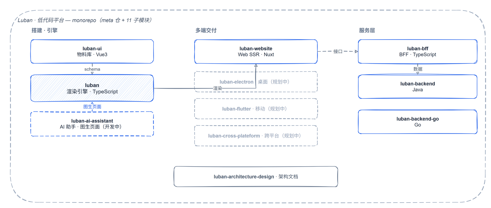

# 👋 Hi, I'm 肖帅

前端 / 全栈开发，11 年经验，前京东云。主要写 TypeScript、Vue、React，后端写 Java 和 Go。

最近在做的事是设计和开发一个低代码平台 **Luban**——可视化搭建、引擎渲染、多端交付，monorepo 形态。

- 🌐 博客：https://xiaoshuai1024.github.io （沉淀都在这）
- 📧 xiaosshuaii@gmail.com
- 📍 山东

---

## 🔧 Luban — 低代码平台

一个低代码平台：可视化编辑器里拖拽物料产出 schema，渲染引擎消费 schema 渲染页面，交付到 Web 端（桌面 / 移动端规划中）。后端 Java + Go 双实现，AI 助手（开发中）支持图生页面。

monorepo 形态：meta 仓 `luban-workspace` 统一治理 11 个子项目（7 已接入，AI 助手开发中，多端客户端规划中）。

👉 入口：https://github.com/xiaoshuai1024/luban-workspace

## ✍️ 技术博客

Hugo 搭的，写前端架构、工程化、高可用和 AI 辅助开发的实战经验。

👉 https://xiaoshuai1024.github.io

## 🛠 其他

- [update-your-vue2](https://github.com/xiaoshuai1024/update-your-vue2) — 把 Vue2 项目升级到 Vue3 的 CLI 工具

---

## 技术栈

## 📊

---

欢迎在 issue 或博客评论区聊低代码、工程化、AI 辅助开发。
